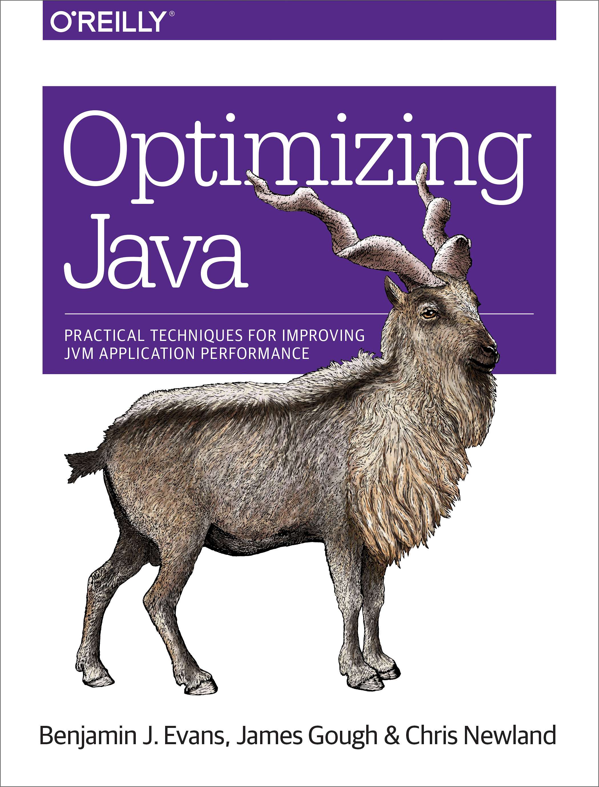
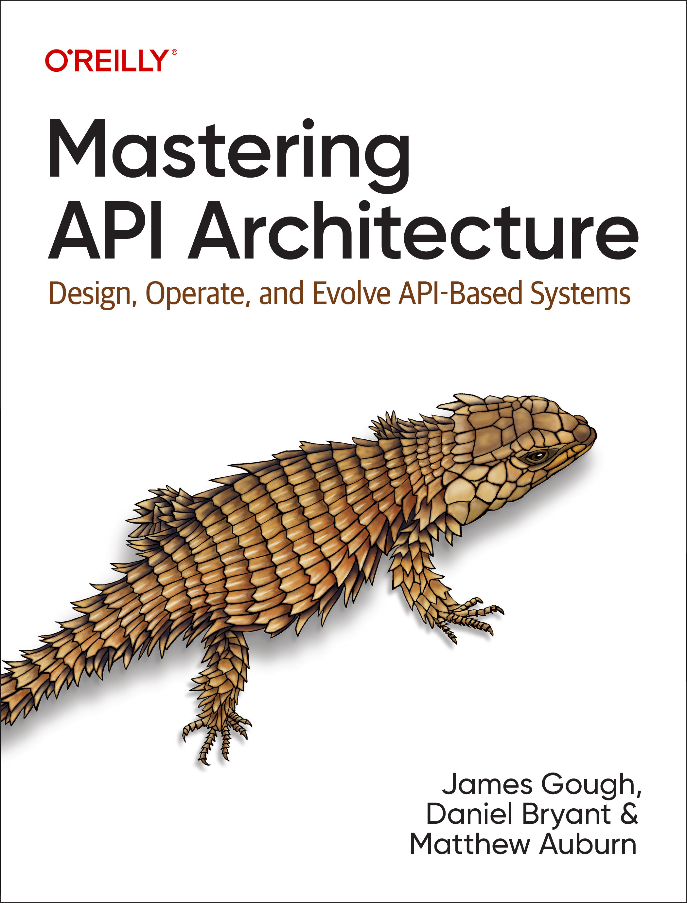

Jim is an engineer at heart and often tinkers and explores the Java ecosystem. 
Jim enjoys working with the Java Community and has represented the London Java Community on the JCP Executive Committee. 
Jim is a published author of [Optimizing Java](https://www.oreilly.com/library/view/optimizing-java/9781492039259/) and was awarded the [Java Champion](https://apexapps.oracle.com/pls/apex/f?p=119297:gb:::::p10_first%2cp10_last:james%2cgough) title. 

Jim is the architect of Morgan Stanley’s API program, with a strong belief in evolving architecture and quality software development. 
Jim is working on a new book, Mastering API Architecture, with O’Reilly.  

Jim is a well recognised conference and user group speaker on Java and architectural topics. 
Jim spent four years as a technical trainer teaching a wide range of programming languages to recently graduated engineers for Morgan Stanley and Bloomberg. 
He regularly guest lectures at the University of Warwick.

